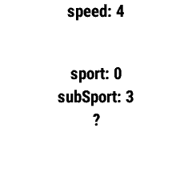

# Garmin Sports Dev

Garmin Sports Dev is for CIQ developers to tinker with the SPORTS and SUB_SPORTS values for saving activities in FIT file.

# Description

Garmin Sports Dev is for CIQ developers to tinker with the SPORTS and SUB_SPORTS values for saving activities in FIT file.

If you like the DF you can thank me by sending a beer: https://paypal.me/GavrielF

## Screenshots

## Changelog

1.0 (2025-03-21) initial release
